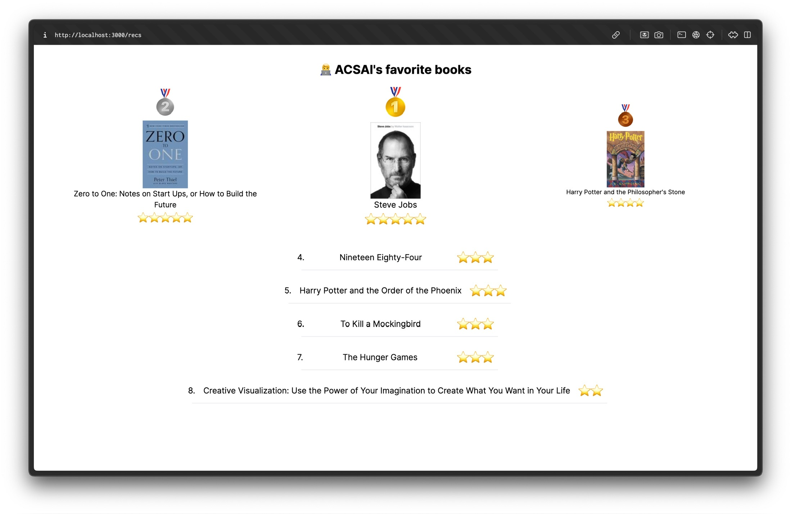

# ACSAIS Favorite Books

<div align="center">
  
  <p><em>Interactive network visualization showing relationships between books and users</em></p>
</div>

A book recommendation application that allows users to vote on books, view community favorites, and get personalized recommendations. This project combines a modern Next.js frontend with Python-based data analysis and uses Supabase for data storage.

## 🚀 Features

- **📊 Book Voting**: Vote on your favorite books
- **❤️ Community Favorites**: View the most popular books among ACSAIS members
- **🕸️ Recommendations**: Get personalized book recommendations based on community data
- **📈 Data Analysis**: Python-based analytics for book trends and user preferences
- **🎨 Modern UI**: Built with Next.js, TypeScript, and Tailwind CSS

<div align="center">
  
  <p><em>Book recommendations interface showing personalized suggestions based on class votes using vector dataset matching for users with similar tastes</em></p>
</div>

## 🛠️ Tech Stack

### Frontend

- **Next.js 14** - React framework for production
- **TypeScript** - Type-safe JavaScript
- **Tailwind CSS** - Utility-first CSS framework
- **Nivo** - Data visualization components

### Backend & Database

- **Supabase** - Backend-as-a-Service with PostgreSQL
- **Python** - Data analysis and processing
- **R** - Statistical analysis and visualization

### Key Dependencies

- `@supabase/supabase-js` - Supabase client for JavaScript
- `@nivo/network` - Network graph visualizations
- `python-dotenv` - Environment variable management
- `vecs` - Vector similarity search
- `psycopg2-binary` - PostgreSQL adapter for Python

## 📦 Installation

### Prerequisites

- Node.js 18+ and npm/pnpm
- Python 3.8+
- R (for data analysis)

### Frontend Setup

1. **Clone the repository**

   ```bash
   git clone <repository-url>
   cd BookRecommendation
   ```

2. **Install Node.js dependencies**

   ```bash
   npm install
   # or
   pnpm install
   ```

3. **Set up environment variables**
   Create a `.env.local` file with your Supabase credentials:

   ```env
   NEXT_PUBLIC_SUPABASE_URL=your-supabase-url
   NEXT_PUBLIC_SUPABASE_ANON_KEY=your-supabase-anon-key
   ```

4. **Run the development server**

   ```bash
   npm run dev
   # or
   pnpm dev
   ```

   Open [http://localhost:3000](http://localhost:3000) to view the application.

### Python Environment Setup

1. **Create a virtual environment**

   ```bash
   chmod +x setup_venv.sh
   ./setup_venv.sh
   ```

2. **Install Python dependencies**
   ```bash
   pip install -r requirements.txt
   ```

## 📁 Project Structure

```
BookRecommendation/
├── src/
│   ├── app/                 # Next.js app directory
│   │   ├── vote/           # Book voting page
│   │   ├── favs/           # Community favorites page
│   │   └── recs/           # Recommendations page
│   └── components/         # Reusable React components
├── data_analysis/          # Python & R analysis scripts
│   ├── bipartite.py       # Network analysis
│   ├── book_analysis.R    # Statistical analysis
│   └── presentation.txt   # Analysis results
├── utils/                  # Utility functions
├── public/                 # Static assets
├── plots/                  # Generated visualizations
└── presentation/           # Project presentation files
```

## 🚀 Usage

1. **Vote on Books**: Navigate to `/vote` to rate and vote on books
2. **View Favorites**: Check out `/favs` to see the community's most loved books
3. **Get Recommendations**: Visit `/recs` for personalized book suggestions based on community preferences

## 📊 Data Analysis

The project includes comprehensive data analysis capabilities:

- **Network Analysis**: Bipartite graph analysis of user-book relationships
- **Statistical Analysis**: R-based statistical modeling of reading preferences
- **Visualization**: Interactive charts and network graphs using Nivo

## 🔧 Available Scripts

### Frontend

- `npm run dev` - Start development server
- `npm run build` - Build for production
- `npm run start` - Start production server
- `npm run lint` - Run ESLint

### Data Analysis

- Run Python scripts in `data_analysis/` for book recommendation algorithms
- Execute R scripts for statistical analysis and visualization

## 🤝 Contributing

1. Fork the repository
2. Create a feature branch (`git checkout -b feature/amazing-feature`)
3. Commit your changes (`git commit -m 'Add amazing feature'`)
4. Push to the branch (`git push origin feature/amazing-feature`)
5. Open a Pull Request

## 🔗 Links

- [Next.js Documentation](https://nextjs.org/docs)
- [Supabase Documentation](https://supabase.com/docs)
- [Tailwind CSS Documentation](https://tailwindcss.com/docs)
